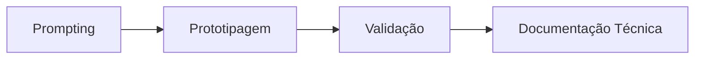

# Projeto Engenharia de Prompt e Aplicações em IA

## 📝 Descrição do Projeto
Neste módulo, documentei aplicações práticas de **engenharia de prompt**, comparando abordagens de interação com LLMs e avaliando o impacto das estratégias de contexto na qualidade das respostas.

A estrutura foi organizada em subprojetos (SM2 a SM7), cada um com objetivo técnico específico e README próprio.

## 🧰 Tecnologias Utilizadas

- **Técnicas:** zero-shot, few-shot e análise comparativa de prompts
- **Ferramentas:** AI Studio, Bubble.io, Expo/React Native
- **Entregáveis:** documentação analítica e protótipos funcionais

## 📊 Resultados e Aprendizados
- **6 subprojetos organizados** com rastreabilidade por diretório.
- **Decisão técnica:** padronizei estrutura de documentação para facilitar avaliação e manutenção.
- **Aprendizado analítico:** a qualidade da resposta dos modelos variou conforme granularidade de contexto e critérios de saída definidos no prompt.

| Projeto | Descrição | Link |
| :--- | :--- | :---: |
| **SM2 - Classificação Visual** | Classificação de imagens com Teachable Machine. | [Ver Projeto](https://github.com/Gabriel-Assis-Silva/portfolio-gabriel-de-assis-silva/tree/main/projeto-engenharia-de-prompt-e-aplicacoes-em-ia/projeto-sm2-laboratorio-de-classificacao-visual) |
| **SM3 - Batalha de Modelos** | Comparação estruturada entre modelos com prompts em XML. | [Ver Projeto](https://github.com/Gabriel-Assis-Silva/portfolio-gabriel-de-assis-silva/tree/main/projeto-engenharia-de-prompt-e-aplicacoes-em-ia/projeto-sm3-batalha-de-modelos-e-engenharia-de-prompt-xml) |
| **SM4 - Engenharia Reversa** | Análise técnica de solução existente e abstração de arquitetura. | [Ver Projeto](https://github.com/Gabriel-Assis-Silva/portfolio-gabriel-de-assis-silva/tree/main/projeto-engenharia-de-prompt-e-aplicacoes-em-ia/projeto-sm4-engenharia-reversa) |
| **SM5 - Do Clone ao MVP+** | Evolução de clone para proposta com diferenciais de produto. | [Ver Projeto](https://github.com/Gabriel-Assis-Silva/portfolio-gabriel-de-assis-silva/tree/main/projeto-engenharia-de-prompt-e-aplicacoes-em-ia/projeto-sm5-do-clone-ao-produto-minimo-viavel-mvp) |
| **SM6 - Software + IA com Bubble** | Prototipagem no-code com integração de IA. | [Ver Projeto](https://github.com/Gabriel-Assis-Silva/portfolio-gabriel-de-assis-silva/tree/main/projeto-engenharia-de-prompt-e-aplicacoes-em-ia/projeto-sm6-engenharia-de-software-e-ia-com-bubble-io) |
| **SM7 - App de Videoconferência** | Aplicativo com Expo + Jitsi para teleatendimento veterinário. | [Ver Projeto](https://github.com/Gabriel-Assis-Silva/portfolio-gabriel-de-assis-silva/tree/main/projeto-engenharia-de-prompt-e-aplicacoes-em-ia/projeto-sm7-desenvolvimento-de-app-de-videoconferencia-com-manus-ai-e-jitsi) |

## 🖼️ Evidência Visual

*Figura 1: Ciclo aplicado nos subprojetos de IA.*

## ▶️ Como Executar
### Pré-requisitos
- Conta em ferramentas de IA (quando necessário)
- Navegador atualizado

### Passos
1. Clone o repositório.
2. Acesse cada pasta `projeto-sm...` para revisar o respectivo README.
3. Execute localmente apenas os projetos que possuem código-fonte e instruções próprias (ex.: SM7).

### Troubleshooting
- Projetos baseados em links externos podem exigir autenticação na plataforma original.

---
<a href="https://github.com/Gabriel-Assis-Silva/portfolio-gabriel-de-assis-silva">Voltar ao início</a>
