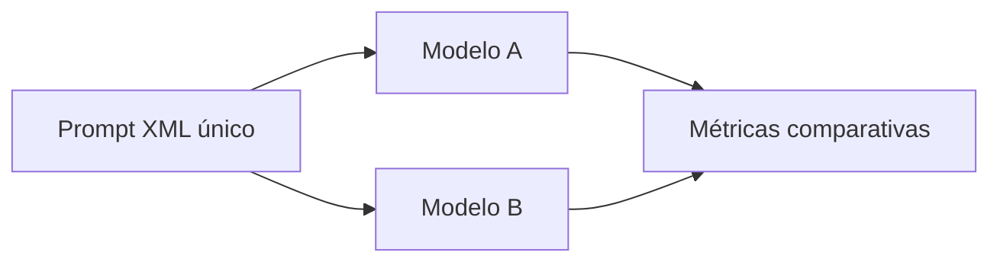

# Projeto SM3 - Batalha de Modelos e Engenharia de Prompt (XML)

## 📝 Descrição do Projeto
Neste experimento, comparei respostas de diferentes modelos de IA a partir de um mesmo problema, utilizando estrutura de prompt em **XML** para controlar contexto, instruções e formato de saída.

A meta foi medir consistência semântica, completude técnica e aderência aos critérios definidos.

## 🧰 Tecnologias Utilizadas


- **Formato de prompt:** XML estruturado
- **Artefato principal:** relatório em PDF

## 📊 Resultados e Aprendizados
- **Comparação multi-modelo** registrada em documento técnico.
- **Decisão técnica:** padronizei o prompt para isolar variação do modelo e reduzir ruído de instrução.
- **Aprendizado analítico:** maior especificidade de saída (campos e critérios) elevou a objetividade das respostas.

## 🖼️ Evidência Visual

*Figura 1: Estrutura de comparação entre modelos no SM3.*

## ▶️ Como Executar
### Pré-requisitos
- Leitor de PDF

### Passos
1. Clone o repositório:
   ```bash
   git clone https://github.com/Gabriel-Assis-Silva/portfolio-gabriel-de-assis-silva.git
   cd portfolio-gabriel-de-assis-silva/projeto-engenharia-de-prompt-e-aplicacoes-em-ia/projeto-sm3-batalha-de-modelos-e-engenharia-de-prompt-xml
   ```
2. Abra o arquivo `Experiência+3+-+Batalha+de+Modelos+&+Engenharia+de+Prompt+(XML).pdf`.
3. Analise os critérios e as respostas comparadas.

### Troubleshooting
- Se o nome do arquivo gerar erro no terminal, use autocompletar (TAB) ou coloque o caminho entre aspas.

---
<a href="https://github.com/Gabriel-Assis-Silva/portfolio-gabriel-de-assis-silva">Voltar ao início</a>
