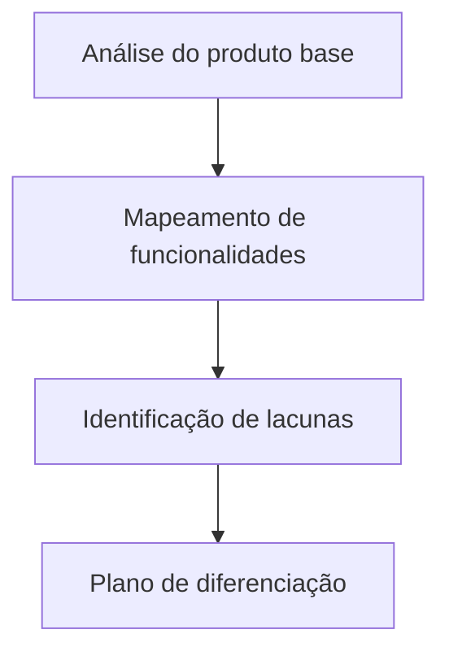

# Projeto SM4 - Engenharia Reversa

## 📝 Descrição do Projeto
Realizei engenharia reversa sobre um projeto existente para identificar arquitetura, decisões de interface e oportunidades de melhoria técnica.

O objetivo foi transformar observações em requisitos acionáveis, evitando cópia literal e priorizando diferenciação funcional.

## 🧰 Tecnologias Utilizadas

- **Referência analisada:** FluxoMD
- **Foco:** arquitetura de funcionalidades e diferenciação

## 📊 Resultados e Aprendizados
- **1 baseline técnico** mapeado para comparação de funcionalidades.
- **Decisão técnica:** documentei diferenciais antes da implementação para reduzir risco de plágio funcional.
- **Aprendizado:** engenharia reversa é mais efetiva quando convertida em hipóteses de melhoria mensuráveis.

## 🖼️ Evidência Visual

*Figura 1: Processo de engenharia reversa aplicado no SM4.*

## ▶️ Como Executar
### Pré-requisitos
- Navegador com acesso ao GitHub

### Passos
1. Acesse o repositório de referência: <https://github.com/Gabriel-Assis-Silva/FluxoMD>
2. Revise arquitetura, fluxos e funcionalidades.
3. Compare com os requisitos definidos para o projeto derivado.

### Troubleshooting
- Caso o repositório não abra, confirme se a URL está acessível publicamente sem autenticação.

---
<a href="https://github.com/Gabriel-Assis-Silva/portfolio-gabriel-de-assis-silva">Voltar ao início</a>
