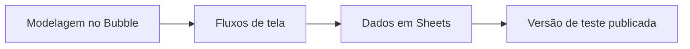

# Projeto SM6 - Engenharia de Software e IA com Bubble.io

## 📝 Descrição do Projeto
Desenvolvi um protótipo no-code com **Bubble.io** para validar fluxo de produto e integração com dados em ambiente de baixa fricção para entrega rápida.

A proposta foi comprovar viabilidade funcional com foco em iteração e aprendizado de produto orientado por feedback.

## 🧰 Tecnologias Utilizadas

- **Plataforma:** Bubble.io
- **Dados auxiliares:** Google Sheets

## 📊 Resultados e Aprendizados
- **1 versão funcional publicada** em ambiente de teste.
- **Decisão técnica:** priorizei no-code para acelerar validação de hipóteses antes de investimento em código customizado.
- **Aprendizado:** em fases iniciais, velocidade de experimentação pode superar complexidade técnica de implementação tradicional.

## 🖼️ Evidência Visual

*Figura 1: Arquitetura de validação rápida no SM6.*

## ▶️ Como Executar
### Pré-requisitos
- Navegador atualizado
- Acesso aos links publicados

### Passos
1. Acesse a aplicação de teste: <https://abyssworshipper-81435.bubbleapps.io/version-test>
2. Consulte a base de dados auxiliar: <https://docs.google.com/spreadsheets/d/11DWOZSM_rrWBzNAt2DSztJCXYtGaSsAJoQSnGTueBpE/edit>
3. Navegue pelo fluxo e valide o comportamento das telas.

### Troubleshooting
- Se o app não abrir, tente em aba anônima para evitar conflito de cache/extensões.

---
<a href="https://github.com/Gabriel-Assis-Silva/portfolio-gabriel-de-assis-silva">Voltar ao início</a>
