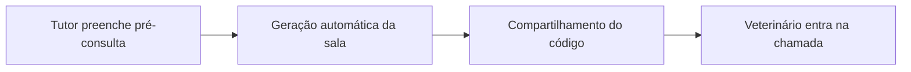

# Projeto SM7 - MedVet Connect
> Plataforma de telemedicina veterinária com videochamada em tempo real.

## 📝 Descrição do Projeto
Implementei o **MedVet Connect** para conectar tutores e veterinários por videochamada, reduzindo tempo de triagem em cenários remotos ou de baixa mobilidade.

No desenho da solução, priorizei fluxo mobile-first, geração automática de sala e integração com **Jitsi Meet** para garantir entrada rápida na consulta.

## 🧰 Tecnologias Utilizadas


- **Stack principal:** Expo Router + React Native + TypeScript
- **Comunicação síncrona:** Jitsi Meet via WebView
- **Persistência local:** histórico de salas com AsyncStorage

## 📊 Resultados e Aprendizados
- **Fluxos implementados:** tutor, veterinário, geração de sala e chamada por vídeo.
- **Decisão técnica:** encapsulei a videochamada com WebView para reduzir complexidade de setup de RTC nativo.
- **Aprendizado analítico:** a combinação de onboarding direto e sala compartilhável melhora aderência do usuário em cenários de urgência.

## 🖼️ Evidência Visual

*Figura 1: Fluxo operacional do MedVet Connect.*

## ▶️ Como Executar
### Pré-requisitos
- Node.js 18+
- pnpm instalado
- Expo CLI

### Passos
1. Clone o repositório e acesse a pasta do projeto:
   ```bash
   git clone https://github.com/Gabriel-Assis-Silva/portfolio-gabriel-de-assis-silva.git
   cd portfolio-gabriel-de-assis-silva/projeto-engenharia-de-prompt-e-aplicacoes-em-ia/projeto-sm7-desenvolvimento-de-app-de-videoconferencia-com-manus-ai-e-jitsi
   ```
2. Instale dependências:
   ```bash
   pnpm install
   ```
3. Rode em desenvolvimento:
   ```bash
   pnpm dev
   ```

### Troubleshooting
- Se `pnpm` não estiver disponível, instale via `npm i -g pnpm`.
- Se a WebView falhar em dispositivo físico, valide conectividade de rede e permissões do app.

---
<a href="https://github.com/Gabriel-Assis-Silva/portfolio-gabriel-de-assis-silva">Voltar ao início</a>
