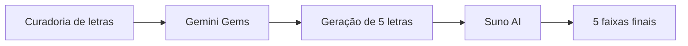

# 🎵 Projeto Música & IA: Composição Generativa com Gemini e Suno

## 📝 Descrição do Projeto
Neste projeto, atuo como **produtor musical** e **engenheiro de prompts** para criar um EP com 5 faixas autorais com apoio de IA.

A proposta combina **Gemini Gems** (análise de estilo e composição de letras) e **Suno AI** (produção de áudio com vocal e instrumental), mantendo consistência estética e documentação técnica reprodutível.

## 🛠️ Tecnologias Utilizadas

- **Gemini Gems:** curadoria de estilo e geração de letras inéditas.
- **Suno AI:** síntese de áudio com ajustes de gênero, clima e BPM.
- **GitHub:** versionamento dos artefatos e documentação do processo.

## 🚀 Assistente Personalizado
O assistente (Gems) utilizado para modelagem das letras:

> **Link do Gemini Gems:** `PREENCHER_AQUI`

## 🎧 Músicas Geradas
| Faixa | Título | Estilo/Referência | Link do Áudio |
| :--- | :--- | :--- | :--- |
| 01 | [Iron Crown Rebellion] | [Estilo/Influência] |     [Ver Arquivo](/projeto-engenharia-de-prompt-e-aplicacoes-em-ia/projeto-sm8-musica-ia/audios/Iron%20Crown%20Rebellion.mp3) |
| 02 | [Sulfur-Screaming Torches] | [Estilo/Influência] | [Ver Arquivo](/projeto-engenharia-de-prompt-e-aplicacoes-em-ia/projeto-sm8-musica-ia/audios/Sulfur-Screaming%20Torches.mp3) |
| 03 | [The Hollow Bastion] | [Estilo/Influência] |       [Ver Arquivo](/projeto-engenharia-de-prompt-e-aplicacoes-em-ia/projeto-sm8-musica-ia/audios/The%20Hollow%20Bastion.mp3) |
| 04 | [The Last Bastion's Echo] | [Estilo/Influência] |  [Ver Arquivo](/projeto-engenharia-de-prompt-e-aplicacoes-em-ia/projeto-sm8-musica-ia/audios/The%20Last%20Bastion's%20Echo.mp3) |
| 05 | [The Relentless Pursuit] | [Estilo/Influência] |   [Ver Arquivo](/projeto-engenharia-de-prompt-e-aplicacoes-em-ia/projeto-sm8-musica-ia/audios/The%20Relentless%20Pursuit.mp3) |

## 📄 Processo de Criação
1. **Curadoria:** selecionar letras de referência do artista base.
2. **Prompt Engineering:** configurar instruções do Gems para vocabulário, métrica e temática.
3. **Composição:** gerar 5 letras inéditas com temas novos.
4. **Produção Fonográfica:** gerar 5 áudios no Suno AI e refinar parâmetros de estilo.
5. **Documentação:** consolidar letras, áudios e evidências no GitHub.

## 🖼️ Evidência Visual

*Figura 1: Pipeline de criação do SM8 (letra + áudio).* 

## ▶️ Como Executar
### Pré-requisitos
- Conta ativa no **Gemini** e no **Suno AI**.
- Navegador atualizado.

### Passos
1. Abra o arquivo `letras-originais.txt` e preencha as 5 letras geradas.
2. Exporte os 5 áudios da Suno em `.mp3` para a pasta `audios/`.
3. Atualize a tabela de faixas neste README com títulos e links dos arquivos.

### Troubleshooting
- Se o Suno não gerar resultado consistente, refine prompt com gênero, BPM, humor e instrumentos.
- Se o Gems sair do estilo esperado, inclua mais exemplos de letras na base de conhecimento.

---
Desenvolvido por <a href="https://github.com/Gabriel-Assis-Silva">Gabriel de Assis Silva</a>

<a href="https://github.com/Gabriel-Assis-Silva/portfolio-gabriel-de-assis-silva">Voltar ao início</a>
