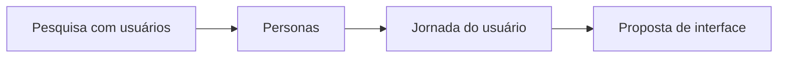

# Projeto Interface e Jornada de Usuário

## 📝 Descrição do Projeto
Desenvolvi este projeto para mapear a experiência do usuário de ponta a ponta, aplicando **UX research**, **personas** e **jornada de uso** para orientar decisões de interface.

O foco foi identificar fricções no fluxo e propor melhorias com base em evidências de pesquisa qualitativa.

## 🧰 Tecnologias Utilizadas


- **Métodos:** Design Centrado no Usuário (DCU)
- **Entregáveis:** personas, mapas de jornada e fluxos
- **Critérios:** heurísticas de Nielsen e acessibilidade

## 📊 Resultados e Aprendizados
- **4 frentes técnicas consolidadas:** personas, jornada, heurísticas e acessibilidade.
- **Decisão técnica:** usei mapeamento de jornada para priorizar pontos críticos com maior impacto na usabilidade.
- **Aprendizado analítico:** a combinação de pesquisa e prototipação reduziu hipóteses subjetivas no design.

## 🖼️ Evidência Visual

*Figura 1: Sequência de análise UX adotada no projeto.*

## ▶️ Como Executar
### Pré-requisitos
- Ferramenta de leitura de markdown
- Acesso aos arquivos de design/documentação da pasta

### Passos
1. Clone o repositório:
   ```bash
   git clone https://github.com/Gabriel-Assis-Silva/portfolio-gabriel-de-assis-silva.git
   cd portfolio-gabriel-de-assis-silva/projeto-interface-e-jornada-de-usuario
   ```
2. Leia os artefatos de pesquisa e análise.
3. Navegue pelos fluxos para validar hipóteses e decisões de UX.

### Troubleshooting
- Se algum recurso externo de protótipo estiver indisponível, utilize a documentação textual para rastrear o fluxo completo.

---
<a href="https://github.com/Gabriel-Assis-Silva/portfolio-gabriel-de-assis-silva">Voltar ao início</a>
