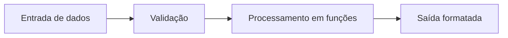

# Projeto Programação de Computadores

## 📝 Descrição do Projeto
Desenvolvi este conjunto de projetos na disciplina de **Programação de Computadores** para consolidar fundamentos de algoritmos, estruturas de controle, ponteiros e manipulação de memória em **C**.

Adotei uma abordagem incremental: comecei com exercícios de base e evoluí para cenários com regras de negócio, entrada de dados e validações.

## 🧰 Tecnologias Utilizadas


- **Linguagem:** C (C99/C11)
- **Compilação:** GCC
- **Ambiente:** VS Code / Code::Blocks

## 📊 Resultados e Aprendizados
- **3 projetos documentados** com foco em criptografia clássica, controle de estoque e manipulação matricial.
- **Melhoria de robustez:** apliquei validação de entrada para reduzir falhas em tempo de execução.
- **Decisão técnica:** priorizei decomposição em funções para reduzir acoplamento e facilitar testes manuais.

| Projeto | Descrição | Link |
| :--- | :--- | :---: |
| **Cifra de César** | Criptografia por deslocamento com tratamento de caracteres. | [Ver no GitHub](https://github.com/Gabriel-Assis-Silva/Projetos-C/tree/main/CifraDeCesar) |
| **Sistema de Loja** | Cadastro de produtos e operações de estoque com lógica procedural. | [Ver no GitHub](https://github.com/Gabriel-Assis-Silva/Projetos-C/tree/main/Loja) |
| **Matrizes** | Operações com matrizes bidimensionais e percursos otimizados. | [Ver no GitHub](https://github.com/Gabriel-Assis-Silva/Projetos-C/tree/main/Matrizes) |

## 🖼️ Evidência Visual

*Figura 1: Pipeline lógico aplicado aos exercícios em C.*

## ▶️ Como Executar
### Pré-requisitos
- GCC instalado (`gcc --version`)
- Terminal Linux/macOS ou Prompt/PowerShell no Windows

### Passos
1. Clone o repositório:
   ```bash
   git clone https://github.com/Gabriel-Assis-Silva/portfolio-gabriel-de-assis-silva.git
   cd portfolio-gabriel-de-assis-silva/projeto-programacao-de-computadores
   ```
2. Compile o arquivo principal do projeto desejado:
   ```bash
   gcc -o programa main.c
   ```
3. Execute:
   ```bash
   ./programa
   ```

### Troubleshooting
- Se o compilador não for encontrado, instale o GCC e reinicie o terminal.
- Em Windows, substitua `./programa` por `programa.exe`.

---
<a href="https://github.com/Gabriel-Assis-Silva/portfolio-gabriel-de-assis-silva">Voltar ao início</a>
