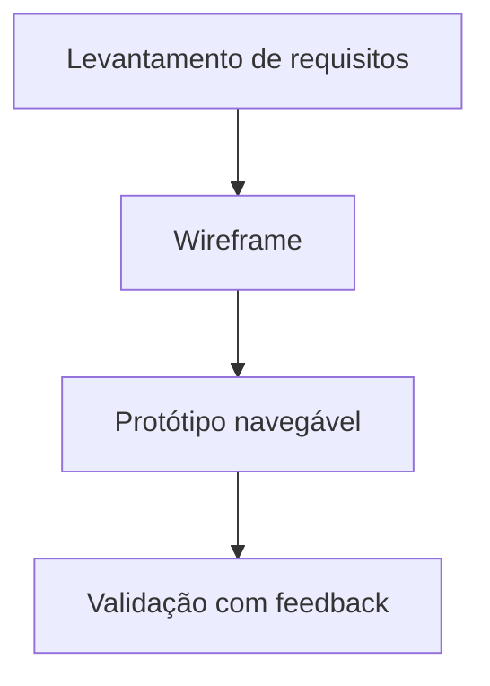

# Projeto Prototipagem de Sistemas Computacionais

## 📝 Descrição do Projeto
Nesta disciplina, estruturei protótipos de soluções digitais com foco em **descoberta de requisitos**, **fluxo de navegação** e **validação de interface**.

A proposta foi transformar necessidades de usuários em artefatos de engenharia visual, reduzindo retrabalho antes da fase de implementação.

## 🧰 Tecnologias Utilizadas


- **Ferramentas:** Figma e Canva
- **Método:** prototipagem de baixa e alta fidelidade
- **Entregáveis:** documentação técnica e fluxos de tela

## 📊 Resultados e Aprendizados
- **2 níveis de prototipagem** (baixa e alta fidelidade) para validar decisões visuais.
- **Redução de ambiguidade:** usei wireframes para alinhar requisitos com clareza.
- **Decisão técnica:** priorizei consistência visual e hierarquia de informação para melhorar escaneabilidade da interface.

## 🖼️ Evidência Visual

*Figura 1: Fluxo de prototipação aplicado no projeto.*

## ▶️ Como Executar
### Pré-requisitos
- Conta no Figma
- Leitor de PDF (quando houver exportações)

### Passos
1. Clone o repositório:
   ```bash
   git clone https://github.com/Gabriel-Assis-Silva/portfolio-gabriel-de-assis-silva.git
   cd portfolio-gabriel-de-assis-silva/projeto-prototipagem-de-sistemas-computacionais
   ```
2. Abra os artefatos visuais nas ferramentas correspondentes.
3. Revise a documentação para entender decisões de UI/UX.

### Troubleshooting
- Caso arquivos de design não abram localmente, importe o conteúdo diretamente no Figma.

---
<a href="https://github.com/Gabriel-Assis-Silva/portfolio-gabriel-de-assis-silva">Voltar ao início</a>
